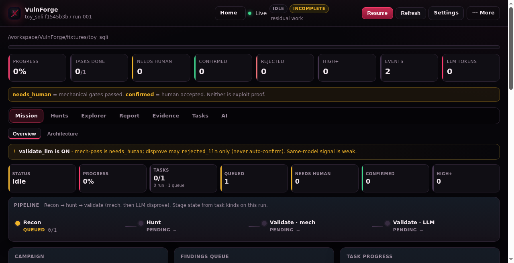
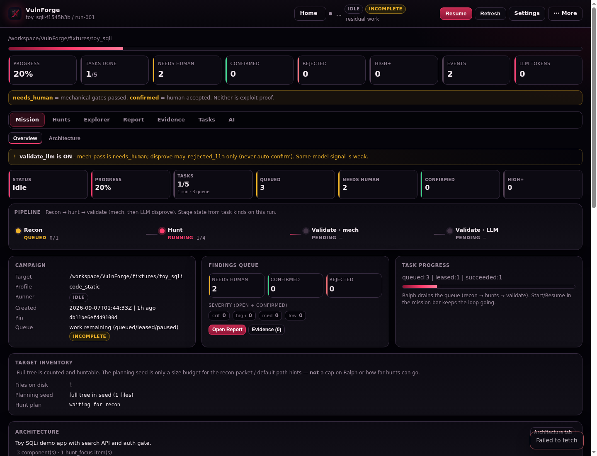
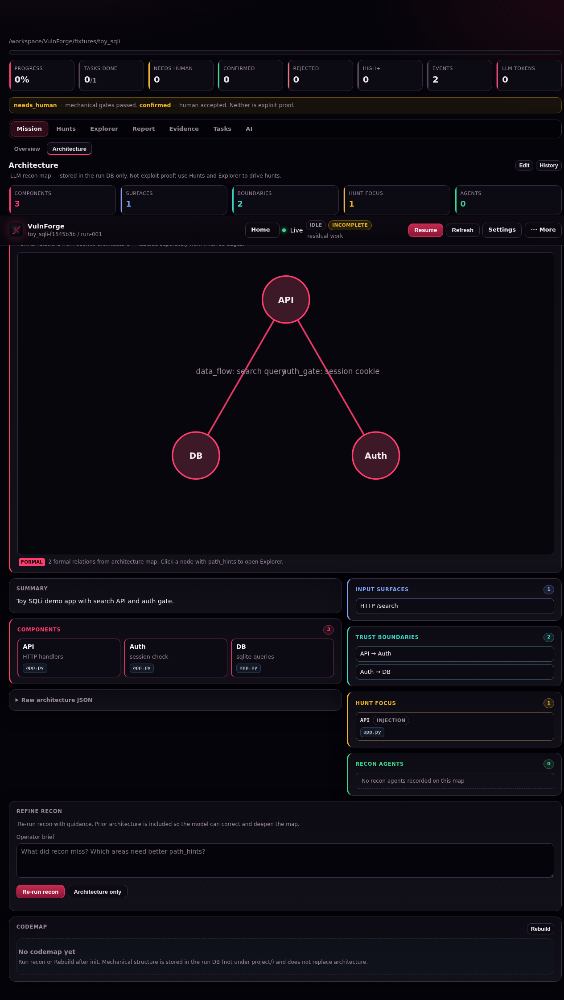

# VulnForge

Local, model-agnostic vulnerability discovery harness for [LM Studio](https://lmstudio.ai/) (or any OpenAI-compatible endpoint) and coding agents.

**One loop:** recon → hunt → mechanical validation → LLM disprove (on by default) → human review — steered from a research-cockpit dashboard. LLM tool-use stages run on the [Strands Agents](https://strandsagents.com/) runtime.

| Label | Meaning |
|-------|---------|
| **`needs_human`** | Passed **mechanical** gates (shape, citations, evidence / justified `no_poc`). **Not** exploit proof. |
| **`confirmed`** | A **human** accepted the finding in the Report UI. Still **not** exploit proof. |

Automation never auto-confirms. Prefer honest `submit_none` over inventing findings.



---

## Prerequisites

- **Python 3.11+** (`python3 --version`)
- An **OpenAI-compatible chat API** (typical: LM Studio on `http://127.0.0.1:1234/v1`)
- A few GB free disk for runs, transcripts, and evidence packs

The dashboard works without a loaded model; recon/hunt tasks need one.

**Scope:** source-code analysis only (`code_static`). PE binaries and reverse-engineering tooling are not supported. Sandbox PoC is **off** unless you opt in (Docker + gVisor `runsc` or a microVM on Linux) — see [docs/harness/validate/SANDBOX_HOST.md](docs/harness/validate/SANDBOX_HOST.md).

---

## Quickstart

Run commands from the **repo root** (the directory that contains `vulnforge/` and `seeds/`):

```bash
cd /path/to/this/repo   # directory with pyproject.toml + vulnforge/

python3 -m venv .venv
source .venv/bin/activate

python -m pip install -U pip
pip install -e ".[dev]"

vf --help
```

Point `config/default.yaml` at your LLM (`llm.base_url`, exact `llm.model` from `GET /v1/models`, `llm.api_mode` — usually `chat_completions` for LM Studio). Or use Dashboard **Settings**: add a host → Refresh catalog → Verify → assign roles → Save (`config/ui_settings.json` overrides YAML). Env overrides: `VF_BASE_URL`, `VF_MODEL`, `VF_HOST`+`VF_PORT`.

Smoke the toy fixture and open the cockpit:

```bash
vf init --target fixtures/toy_sqli
# → runs/<target_id>/run-001

vf dashboard
# → http://127.0.0.1:8787
```

Leave the dashboard running. Open the new run and **Start** Ralph, or in another terminal:

```bash
python scripts/ralph.py --run-dir runs/<target_id>/run-001 --max-tasks 20
```

After `git pull`, restart `vf dashboard` so it loads the new UI.

Windows PowerShell install notes: [docs/README.md](docs/README.md) (operator path) — same `vf init` / `vf dashboard` once the venv is active.

---

## How a run looks

A **run** is one durable audit against a target tree. Ralph drains the queue: recon → hunts → validate. Mission shows progress, the findings queue, and what still needs a human.



What the strip is telling you:

- **Needs Human** — mechanical gates passed; open **Report** to accept or reject. Neither state is exploit proof.
- **Confirmed / Rejected** — only change when a human acts in Report. The LLM may **disprove** (reject path); it never auto-confirms.
- **Pipeline** — stage state from task kinds on this run (`Recon → hunt → validate (mech, then LLM disprove)`).

Steer from **Explorer** (enqueue hunts), **Hunts** (residual cells), and **Report** (accept / reject / develop PoC).

---

## Architecture map

Mission → **Architecture** is the LLM recon map for the run (components, surfaces, trust boundaries, hunt focus). It is stored in the run DB — use Hunts and Explorer to drive work, not the diagram alone.



Mechanical structure (codemap) lives separately in the run database; it does not replace this high-level view.

---

## Daily workflow

| Step | Command / UI |
|------|----------------|
| New audit | Dashboard **New**, or `vf init --target PATH` |
| Drive queue | Dashboard **Start** / **Resume**, or `python scripts/ralph.py --run-dir DIR` |
| One task | `vf run-once --run-dir DIR` |
| Status | `vf status --run-dir DIR`, Mission strip |
| Campaign verbs | `start` `stop` `pause` `resume` `status` `findings` `gate` — [docs/harness/CAMPAIGN.md](docs/harness/CAMPAIGN.md) |
| Steer | Explorer, Hunts, Report |
| Dev tools | Home → **Dev** (hunt skills, recon agents) |
| Tool gaps | `vf tool-gaps --run-dir DIR` or Home **Tool gaps** |

### Useful CLI

| Command | Use |
|---------|-----|
| `vf init --target PATH` | New run under `runs/` |
| `vf run-once --run-dir DIR` | Lease + execute one task |
| `vf status --run-dir DIR` | Task/finding summary |
| `vf project --run-dir DIR` | Regenerate `project/*` |
| `vf tool-gaps --run-dir DIR` | Mine transcripts for tool gaps |
| `vf dashboard` | Research cockpit (`--host` / `--port` optional) |
| `vf export-validation-job --finding-id N` | Zip finding + evidence for handoff |
| `vf validate-poc --finding-id N [--execute]` | Enqueue or run PoC harness (opt-in sandbox) |
| `vf delete-run --run-dir DIR` | Permanently delete a run |
| `python scripts/ralph.py --run-dir DIR` | Outer loop until idle / STOP / budget |

Default dashboard: **http://127.0.0.1:8787**

```bash
vf dashboard --host 127.0.0.1 --port 8787
```

### Dashboard surfaces

| Surface | Purpose |
|---------|---------|
| **Home** | All runs, progress, LLM token rollups |
| **Mission** | Architecture map, campaign strip, operator recon re-run |
| **Hunts** | Plan area×skill batches; residual-risk matrix |
| **Explorer** | Browse target; enqueue class×path hunts |
| **Report** | Findings review (accept / reject / develop PoC) |
| **Evidence** | On-disk evidence packs |
| **Tasks** | Queue, transcripts, event timeline |
| **AI** | Run-bound co-pilot (mutating tools need Confirm) |
| **Dev** | Hunt skills, recon agents, generate custom skills |
| **Benchmarks** | Mechanical L0 suites (no live model required on Run); live LLM optional |

---

## Project layout

```text
.
├── vulnforge/           # Python package (control plane, stages, UI)
├── seeds/               # Package seed library
├── config/              # default.yaml, hunt_profiles/, recon_agents/
├── scripts/ralph.py     # Outer loop
├── docs/                # LAYOUT.md, harness docs, images/
├── fixtures/            # Toy targets for tests / first run
├── skill/SKILL.md       # Optional agent skill for coding agents
├── tests/
└── pyproject.toml
```

If you only cloned the package folder, place `seeds/`, `config/`, `scripts/`, `fixtures/`, and `pyproject.toml` next to `vulnforge/` so `PROJECT_ROOT` resolves. See [`docs/LAYOUT.md`](docs/LAYOUT.md) and [`seeds/README.md`](seeds/README.md).

---

## Troubleshooting

| Problem | Fix |
|---------|-----|
| `vf: command not found` | Activate `.venv` and `pip install -e .` from repo root |
| Dashboard import errors | Reinstall from repo root: `pip install -e .` (FastAPI is core). `.[dev]` adds pytest. |
| Recon/hunt fail with transport | Start LM Studio; check `config/default.yaml` `base_url` / `model` |
| Empty / truncated answers | Raise `llm.max_tokens` (reasoning models need headroom) |
| Wrong prompts path | Run from repo root; ensure `seeds/system/` exists beside `vulnforge/` |
| Port in use | `vf dashboard --port 8788` |

Model-specific notes (Ornith toolgen vs tool_calls, mlx token caps): see `toolgen.md` and Dashboard **Settings → Optimize AI settings**.

---

## Docs

- [`docs/README.md`](docs/README.md) — which file to open
- [`PROTOCOL.md`](PROTOCOL.md) — authority model, labels, apply-candidate contract
- [`AGENTS.md`](AGENTS.md) — extending tools, profiles, and the cockpit
- [`docs/LAYOUT.md`](docs/LAYOUT.md) — where is X? (seeds, tools, config)
- [`skill/SKILL.md`](skill/SKILL.md) — optional skill for coding agents using this harness

## License

MIT

---

## Authorized use

VulnForge is for **authorized** defensive review of codebases you own or have permission to audit. Do not point it at systems or trees outside that scope.

