# VulnForge — Agents & System Map

Granular map of how VulnForge works: control plane, outer loop, task kinds, LLM agents, tools, validation, operator UI, and on-disk authority.  
Source of truth for behavior remains code + [`PROTOCOL.md`](../PROTOCOL.md) + [`AGENTS.md`](../AGENTS.md); this doc is the topology and flow view.

---

## 1. One-sentence model

**VulnForge** is a durable, SQLite-backed security-audit **task queue**. An outer loop (**Ralph**) repeatedly runs **`vf run-once`**, which leases one task, dispatches a **stage handler**, and exits with a protocol exit code. LLM “agents” are **stateless tool-loops** per task (fresh process each iteration); durable state lives in `harness.db`, `evidence/`, transcripts, and events.

---

## 2. System context (clients → control plane)

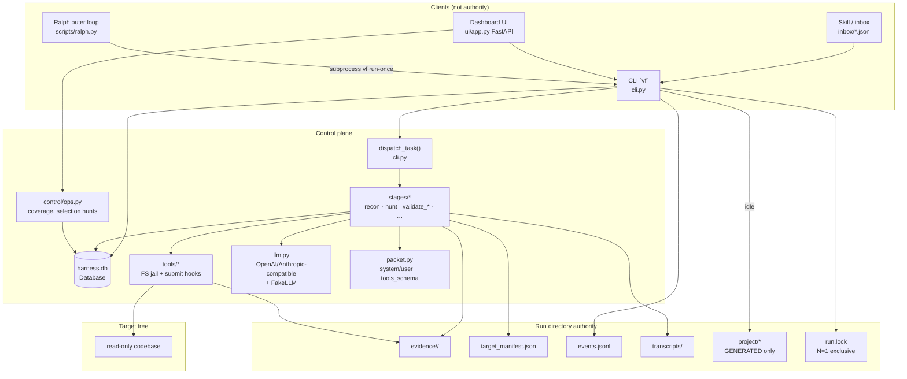
```mermaid
flowchart TB
  subgraph clients["Clients (not authority)"]
    CLI["CLI `vf`\ncli.py"]
    Ralph["Ralph outer loop\nscripts/ralph.py"]
    Dash["Dashboard UI\nui/app.py FastAPI"]
    Skill["Skill / inbox\ninbox/*.json"]
  end

  subgraph control["Control plane"]
    Ops["control/ops.py\ncoverage, selection hunts"]
    Dispatch["dispatch_task()\ncli.py"]
    DB[("harness.db\nDatabase")]
    Stages["stages/*\nrecon · hunt · validate_* · …"]
    Tools["tools/*\nFS jail + submit hooks"]
    LLM["llm.py\nOpenAI/Anthropic-compatible\n+ FakeLLM"]
    Packet["packet.py\nsystem/user + tools_schema"]
  end

  subgraph disk["Run directory authority"]
    Ev["evidence/<id>/"]
    Man["target_manifest.json"]
    Evt["events.jsonl"]
    Tr["transcripts/"]
    Proj["project/*\nGENERATED only"]
    Lock["run.lock\nN=1 exclusive"]
  end

  subgraph target["Target tree"]
    T["read-only codebase"]
  end

  CLI --> Dispatch
  Ralph -->|"subprocess vf run-once"| CLI
  Dash --> Ops
  Dash --> CLI
  Skill --> CLI
  Ops --> DB
  Dispatch --> Stages
  Stages --> Packet
  Stages --> LLM
  Stages --> Tools
  Stages --> DB
  Tools --> T
  Tools --> Ev
  Stages --> Ev
  Stages --> Tr
  CLI --> DB
  CLI --> Evt
  CLI --> Lock
  Stages --> Man
  CLI -->|"idle"| Proj
```

| Client | Role |
|--------|------|
| **`vf init`** | Create run dir, manifest, DB, enqueue first tasks |
| **`vf run-once`** | Lease one task → stage → complete/fail; exit code |
| **Ralph** | Loop `run-once` until idle / STOP / budget / config |
| **Dashboard** | Operator cockpit: Mission, Coverage, Explorer, Report, Tasks, Dev |
| **inbox** | External candidate apply (`vf apply-candidate`) |

---

## 3. Run layout & authority

```
runs/<target_id>/<run_id>/
  harness.db              # SOLE authority: tasks, findings, architecture, coverage, notes
  target_manifest.json    # file hashes at init (mech gate: target_unmodified)
  evidence/<evidence_id>/ # PoC packs (agents write only here via write_evidence)
  transcripts/task-*.json # LLM message transcripts per task/pass
  events.jsonl            # append-only infra/ops log
  llm_usage.jsonl         # token/usage accounting
  project/                # CODEMAP.md, REPORT.md, STATE.md, findings.json (projection)
  inbox/                  # pending skill submissions
  run.lock                # exclusive when max_leases_parallel == 1
  STOP                    # Ralph cooperative stop
  ralph.log / ralph.pid   # outer-loop artifacts
```

| Artifact | Authority |
|----------|-----------|
| `harness.db` | Tasks, findings, leases, architecture (+ revisions), coverage_facts, notes |
| `evidence/` | Artifacts claimed by findings |
| `target_manifest.json` | Snapshot hashes for integrity checks |
| `events.jsonl` | Infra timeline (best-effort concurrent append) |
| `project/*` | **Never** source of truth — regenerate via render |

### DB tables (schema sketch)

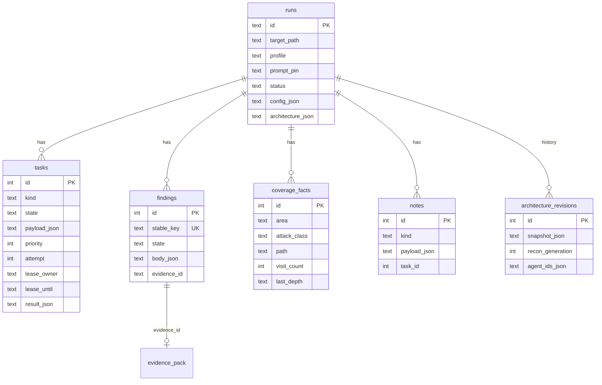
```mermaid
erDiagram
  runs ||--o{ tasks : has
  runs ||--o{ findings : has
  runs ||--o{ coverage_facts : has
  runs ||--o{ notes : has
  runs ||--o{ architecture_revisions : history
  findings ||--o| evidence_pack : evidence_id

  runs {
    text id PK
    text target_path
    text profile
    text prompt_pin
    text status
    text config_json
    text architecture_json
  }
  tasks {
    int id PK
    text kind
    text state
    text payload_json
    int priority
    int attempt
    text lease_owner
    text lease_until
    text result_json
  }
  findings {
    int id PK
    text stable_key UK
    text state
    text body_json
    text evidence_id
  }
  coverage_facts {
    int id PK
    text area
    text attack_class
    text path
    int visit_count
    text last_depth
  }
  notes {
    int id PK
    text kind
    text payload_json
    int task_id
  }
  architecture_revisions {
    int id PK
    text snapshot_json
    int recon_generation
    text agent_ids_json
  }
```

---

## 4. Outer loop: Ralph ↔ `run-once`

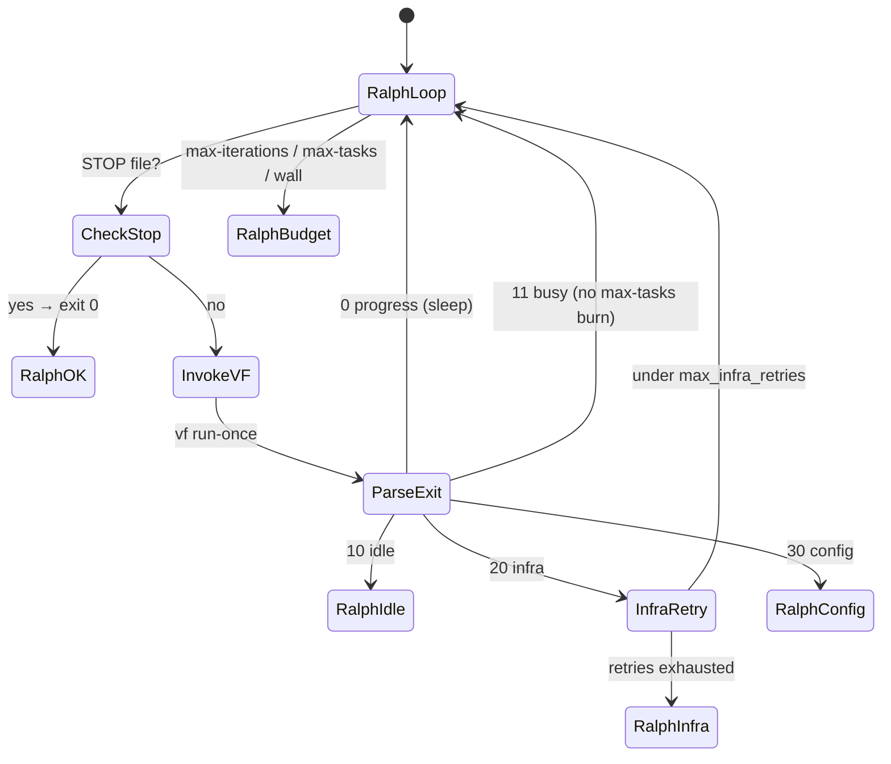
```mermaid
stateDiagram-v2
  [*] --> RalphLoop
  RalphLoop --> CheckStop: STOP file?
  CheckStop --> RalphOK: yes → exit 0
  CheckStop --> InvokeVF: no
  InvokeVF --> ParseExit: vf run-once
  ParseExit --> RalphLoop: 0 progress (sleep)
  ParseExit --> RalphLoop: 11 busy (no max-tasks burn)
  ParseExit --> RalphIdle: 10 idle
  ParseExit --> InfraRetry: 20 infra
  ParseExit --> RalphConfig: 30 config
  InfraRetry --> RalphLoop: under max_infra_retries
  InfraRetry --> RalphInfra: retries exhausted
  RalphLoop --> RalphBudget: max-iterations / max-tasks / wall
```

| `vf` exit | Meaning | Ralph |
|-----------|---------|-------|
| **0** | Progress (task finished this turn) | continue; counts `--max-tasks` |
| **10** | Idle / complete | stop OK (`RALPH_IDLE`) |
| **11** | Busy (lease cap; peer working) | continue; **does not** count progress budget |
| **20** | Infra (retryable) | backoff; cap → `RALPH_INFRA` |
| **30** | Config / hard error | halt |

Ralph design intent: **SpecterOps Day Shift style** — each iteration is a **fresh process**; model context is not durable; disk is.

### Multi-worker (concurrent agents)

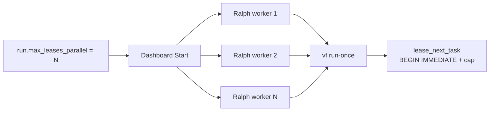
```mermaid
flowchart LR
  Settings["run.max_leases_parallel = N"]
  DashStart["Dashboard Start"]
  W1["Ralph worker 1"]
  W2["Ralph worker 2"]
  WN["Ralph worker N"]
  RO["vf run-once"]
  Lease["lease_next_task\nBEGIN IMMEDIATE + cap"]

  Settings --> DashStart
  DashStart --> W1 & W2 & WN
  W1 & W2 & WN --> RO
  RO --> Lease
```

- **N = 1**: exclusive `run.lock` for whole `run-once`.
- **N > 1**: skip exclusive lock; SQLite coordinates leases. Workers that cannot lease return **11**, not 0.

---

## 5. `run-once` internal sequence

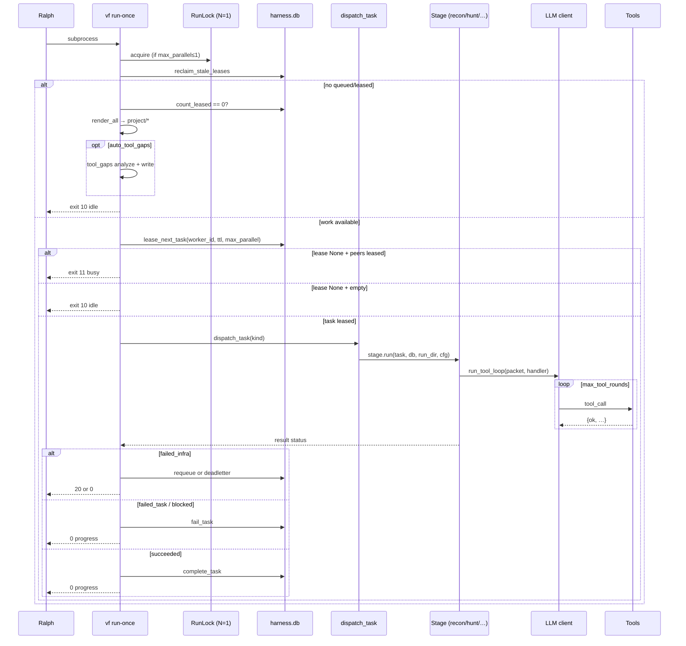
```mermaid
sequenceDiagram
  participant R as Ralph
  participant VF as vf run-once
  participant L as RunLock (N=1)
  participant DB as harness.db
  participant D as dispatch_task
  participant S as Stage (recon/hunt/…)
  participant LLM as LLM client
  participant T as Tools

  R->>VF: subprocess
  VF->>L: acquire (if max_parallel≤1)
  VF->>DB: reclaim_stale_leases
  alt no queued/leased
    VF->>DB: count_leased == 0?
    VF->>VF: render_all → project/*
    opt auto_tool_gaps
      VF->>VF: tool_gaps analyze + write
    end
    VF-->>R: exit 10 idle
  else work available
    VF->>DB: lease_next_task(worker_id, ttl, max_parallel)
    alt lease None + peers leased
      VF-->>R: exit 11 busy
    else lease None + empty
      VF-->>R: exit 10 idle
    else task leased
      VF->>D: dispatch_task(kind)
      D->>S: stage.run(task, db, run_dir, cfg)
      S->>LLM: run_tool_loop(packet, handler)
      loop max_tool_rounds
        LLM->>T: tool_call
        T-->>LLM: {ok, …}
      end
      S-->>VF: result status
      alt failed_infra
        VF->>DB: requeue or deadletter
        VF-->>R: 20 or 0
      else failed_task / blocked
        VF->>DB: fail_task
        VF-->>R: 0 progress
      else succeeded
        VF->>DB: complete_task
        VF-->>R: 0 progress
      end
    end
  end
```

### Task state machine

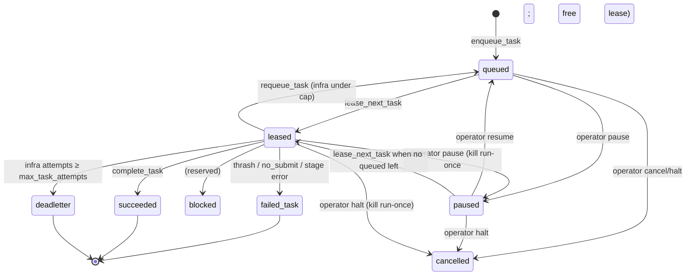
```mermaid
stateDiagram-v2
  [*] --> queued: enqueue_task
  queued --> leased: lease_next_task
  leased --> succeeded: complete_task
  leased --> failed_task: thrash / no_submit / stage error
  leased --> blocked: (reserved)
  leased --> deadletter: infra attempts ≥ max_task_attempts
  leased --> queued: requeue_task (infra under cap)
  queued --> paused: operator pause
  leased --> paused: operator pause (kill run-once; free lease)
  paused --> queued: operator resume
  paused --> leased: lease_next_task when no queued left
  queued --> cancelled: operator cancel/halt
  paused --> cancelled: operator halt
  leased --> cancelled: operator halt (kill run-once)
  failed_task --> [*]
  succeeded --> [*]
  deadletter --> [*]
```

**Semantics**

- Thrash / empty / `max_tool_rounds` / `no_submit` → **`failed_task`** (progress, not infra).
- Transport / model-list under attempt cap → **requeue + exit 20**; at cap → **deadletter + exit 0**.

---

## 6. Task kinds & pipeline

### Default campaign pipeline

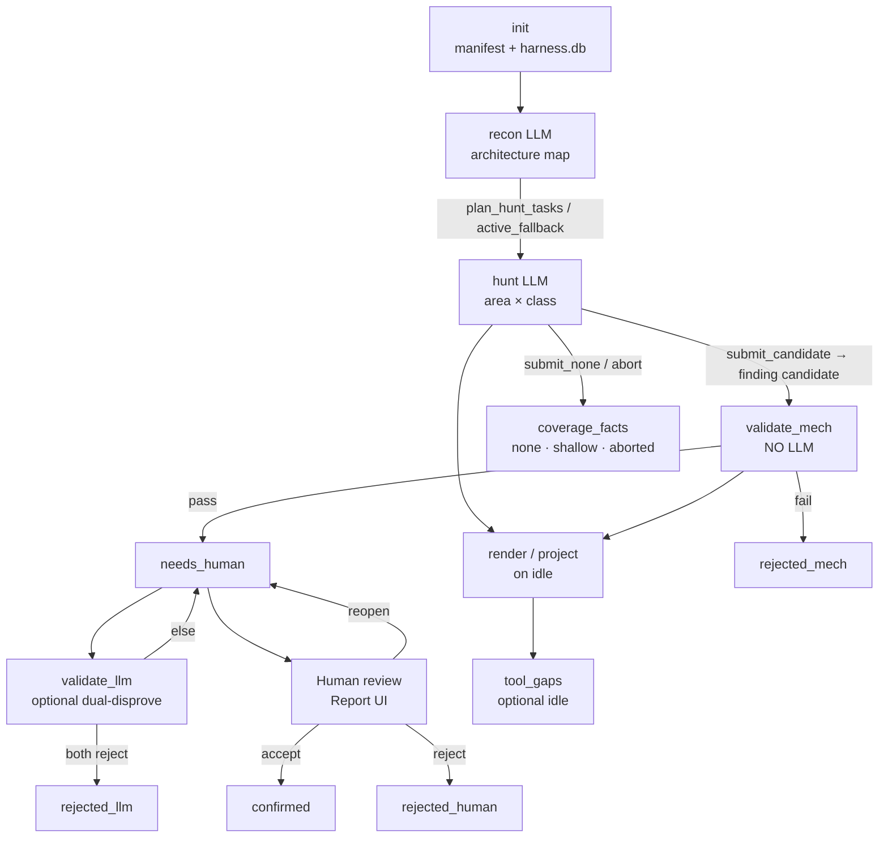
```mermaid
flowchart TD
  INIT["init\nmanifest + harness.db"]
  RECON["recon LLM\narchitecture map"]
  HUNT["hunt LLM\narea × class"]
  MECH["validate_mech\nNO LLM"]
  VLLM["validate_llm\noptional dual-disprove"]
  HUMAN["Human review\nReport UI"]
  RENDER["render / project\non idle"]
  TGAPS["tool_gaps\noptional idle"]

  INIT --> RECON
  RECON -->|"plan_hunt_tasks / active_fallback"| HUNT
  HUNT -->|"submit_candidate → finding candidate"| MECH
  HUNT -->|"submit_none / abort"| COV["coverage_facts\nnone · shallow · aborted"]
  MECH -->|"pass"| NH["needs_human"]
  MECH -->|"fail"| RM["rejected_mech"]
  NH --> VLLM
  VLLM -->|"both reject"| RL["rejected_llm"]
  VLLM -->|"else"| NH
  NH --> HUMAN
  HUMAN -->|"accept"| CF["confirmed"]
  HUMAN -->|"reject"| RH["rejected_human"]
  HUMAN -->|"reopen"| NH
  HUNT --> RENDER
  MECH --> RENDER
  RENDER --> TGAPS
```

### All dispatchable kinds (`dispatch_task`)

| Kind | LLM? | Priority (typical) | Role |
|------|------|--------------------|------|
| **`recon`** | Yes | ~10 | Map architecture; enqueue hunts (or batch finalize) |
| **`hunt`** | Yes | ~40–100 | One area × weakness class investigation |
| **`validate_mech`** | **No** | ~20 | Mechanical gates on finding |
| **`validate_llm`** | Yes (if enabled) | ~25 | Dual adversarial disprove; never confirms |
| **`develop_poc`** | Yes | operator | Runnable PoC under evidence pack |
| **`render`** | No | — | Project projection (also idle path) |
| **`tool_gaps`** | optional | ~90 | Mine missing-tool signals |
| **`generate_skill`** | Yes | operator | Author a hunt profile from brief |
| **`generate_run_skills`** | Yes | post-recon | N target-specific skills when dynamic_skills |
| **`gapfill`** | deferred | — | `NotImplementedError` → failed_task progress |
| **`dedup` / `feedback`** | deferred | — | Modules exist; not product stages |

### Finding state machine

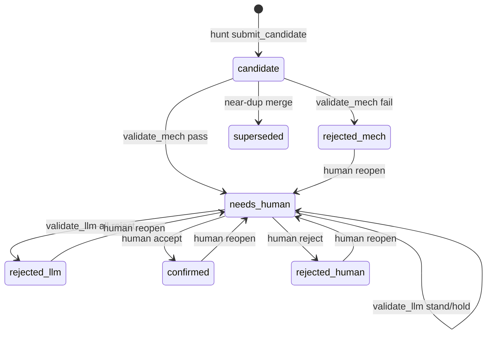
```mermaid
stateDiagram-v2
  [*] --> candidate: hunt submit_candidate
  candidate --> rejected_mech: validate_mech fail
  candidate --> needs_human: validate_mech pass
  needs_human --> rejected_llm: validate_llm all reject
  needs_human --> needs_human: validate_llm stand/hold
  needs_human --> confirmed: human accept
  needs_human --> rejected_human: human reject
  rejected_mech --> needs_human: human reopen
  rejected_llm --> needs_human: human reopen
  rejected_human --> needs_human: human reopen
  confirmed --> needs_human: human reopen
  candidate --> superseded: near-dup merge
```

**Honesty rules (non-negotiable)**

- **`needs_human`** = mechanical gates passed. **Not** exploit proof.
- **`confirmed`** = human accepted. **Automation never sets confirmed.**
- Target tree is **read-only** for agents; evidence only under `evidence/`.

---

## 7. Init strategies

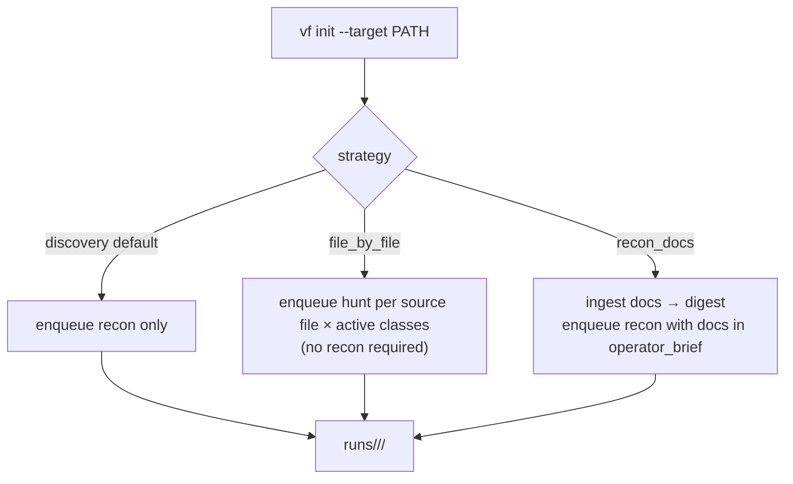
```mermaid
flowchart TD
  Init["vf init --target PATH"]
  Init --> Strat{strategy}

  Strat -->|discovery default| R["enqueue recon only"]
  Strat -->|file_by_file| F["enqueue hunt per source file × active classes\n(no recon required)"]
  Strat -->|recon_docs| D["ingest docs → digest\nenqueue recon with docs in operator_brief"]

  R --> Run["runs/<tid>/<rid>/"]
  F --> Run
  D --> Run
```

Init also:

1. Builds **`target_manifest.json`** (inventory + hashes, ignore_globs).
2. Creates **`harness.db`**, prompt_pin hash of `prompts/v1`.
3. Seeds config from `config/default.yaml` + CLI overrides.
4. Optionally wires progress callbacks for dashboard jobs.

---

## 8. Recon agents (architecture mappers)

Recon is **not** a single hardcoded prompt. Operator **recon agent collection** (`config/recon_agents/`) defines specialized mappers.

### Collection (seed library)

| Agent id | Default active | Job |
|----------|----------------|-----|
| **`default-map`** | ✅ | Primary architecture + `hunt_focus` planner |
| **`surface-mapper`** | optional | Deepen path-backed input surfaces / entrypoints |
| **`dependency-risk`** | optional | Third-party / supply-chain / secrets surfaces |
| **`auth-model`** | optional | AuthN/AuthZ boundaries with path evidence |

Bodies live in `config/recon_agents/bodies/*.md` (seeded from `prompts/v1/recon_agents/`).

### Single-task sequential multi-agent vs batch fan-out

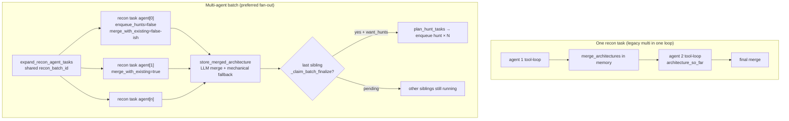
```mermaid
flowchart TB
  subgraph single["One recon task (legacy multi in one loop)"]
    A1["agent 1 tool-loop"] --> M1["merge_architectures in memory"]
    M1 --> A2["agent 2 tool-loop\narchitecture_so_far"]
    A2 --> M2["final merge"]
  end

  subgraph batch["Multi-agent batch (preferred fan-out)"]
    E["expand_recon_agent_tasks\nshared recon_batch_id"]
    E --> T0["recon task agent[0]\nenqueue_hunts=false\nmerge_with_existing=false-ish"]
    E --> T1["recon task agent[1]\nmerge_with_existing=true"]
    E --> Tn["recon task agent[n]"]
    T0 & T1 & Tn --> Store["store_merged_architecture\nLLM merge + mechanical fallback"]
    Store --> Fin{"last sibling\n_claim_batch_finalize?"}
    Fin -->|yes + want_hunts| Plan["plan_hunt_tasks → enqueue hunt × N"]
    Fin -->|pending| Wait["other siblings still running"]
  end
```

**Per recon task (granular steps)**

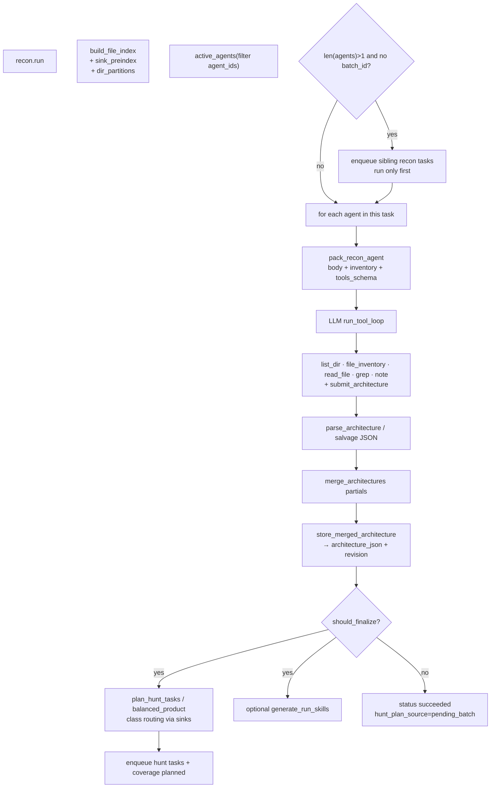
```mermaid
flowchart TD
  Start["recon.run"]
  Inv["build_file_index\n+ sink_preindex\n+ dir_partitions"]
  Agents["active_agents(filter agent_ids)"]
  Fan{"len(agents)>1 and no batch_id?"}
  Fan -->|yes| Split["enqueue sibling recon tasks\nrun only first"]
  Fan -->|no| Loop
  Split --> Loop["for each agent in this task"]
  Loop --> Pack["pack_recon_agent\nbody + inventory + tools_schema"]
  Pack --> TL["LLM run_tool_loop"]
  TL --> ToolsR["list_dir · file_inventory · read_file · grep · note\n+ submit_architecture"]
  ToolsR --> Parse["parse_architecture / salvage JSON"]
  Parse --> MergePass["merge_architectures partials"]
  MergePass --> Store2["store_merged_architecture\n→ architecture_json + revision"]
  Store2 --> Finalize{"should_finalize?"}
  Finalize -->|yes| Hunts["plan_hunt_tasks / balanced_product\nclass routing via sinks"]
  Finalize -->|yes| Dyn["optional generate_run_skills"]
  Finalize -->|no| Done["status succeeded\nhunt_plan_source=pending_batch"]
  Hunts --> Done2["enqueue hunt tasks + coverage planned"]
```

**Recoverable recon failures** (auto child recon, generation++):  
`max_tool_rounds`, `no_submit`, `no_architecture`, `no_hunt_tasks`, empty/truncated/context_length, etc. Cap: `run.max_recon_auto_retries`.

**Architecture merge**

- Subsequent recon **merges** with prior map (`architecture_llm_merge`, mechanical fallback).
- Mission **History** can view/restore `architecture_revisions` (cap 50).

**Hunt planning sources** (after architecture)

1. LLM `hunt_focus` from architecture (class × area/path hints).
2. **Active hunt profiles** fallback (`active_fallback`).
3. Balanced product over areas × classes, **sink-aware class routing**.
4. Operator Coverage / Explorer / `request_hunt` mid-campaign.

---

## 9. Hunt agents (area × class)

Each **hunt** task is one investigation cell:

```json
{
  "area": "auth",
  "class": "injection",
  "path_hints": ["packages/auth/"],
  "force_depth": false,
  "seed_sinks": [],
  "parent_task_id": null
}
```

### Hunt skill collection

Runtime authority: **`config/hunt_profiles/`** (not package prompts).  
Package `prompts/v1/hunt_classes/` is **seed library only** (first open / reseed).

Examples of classes: `injection`, `access-control`, `business-logic`, `cryptography`, `graphql`, `memory-safety`, `supply-chain`, `ai-llm`, `chains`, `client-side`, `feature-abuse`, `web-protocol-auth`, `obvious`, `wildcard`, plus operator/custom.

Profile metadata may include: `active`, CWE tags, `sink_families`, `angle_ids`, optional **tools allowlist**, specificity.

### Hunt tool-loop (granular)

```mermaid
sequenceDiagram
  participant H as hunt.run
  participant P as pack_hunt
  participant L as LLM
  participant TH as build_tool_handler
  participant S as session dict
  participant DB as harness.db

  H->>H: architecture_slice, known_findings, seed_sinks
  H->>P: system (preamble + class body + angles) + tools_schema
  H->>L: run_tool_loop(max_rounds, temperature_hunt)
  loop until submit_* ok or max_rounds
    L->>TH: list_dir / file_inventory / read_file / grep
    TH-->>L: results (soft path jail via scope)
    L->>TH: note / write_evidence / list_hunt_profiles / request_hunt
    L->>TH: submit_candidate | submit_none
    TH->>S: store candidate or none_reason
  end
  alt none_reason + shallow + not force_depth
    H->>DB: coverage shallow; enqueue child force_depth
  else none_reason
    H->>DB: coverage none|shallow
  else candidate
    H->>H: prepare_candidate_submission + shape validate
    H->>H: merge_near_duplicate (stable_key)
    H->>DB: insert_finding candidate
    H->>DB: enqueue validate_mech
    H->>DB: coverage candidate
  else no submit
    H->>DB: coverage aborted; maybe_auto_split
    H-->>H: failed_task no_submit
  end
```

### Soft path jail (`scope`)

| Field | Meaning |
|-------|---------|
| `path_hints` | Prefer reads under these prefixes |
| `force_depth` | Shallow-requeue child: must use deeper tools before `submit_none` |
| `widened` | One-time widen after thrash |

### Shallow / abort / split ladder

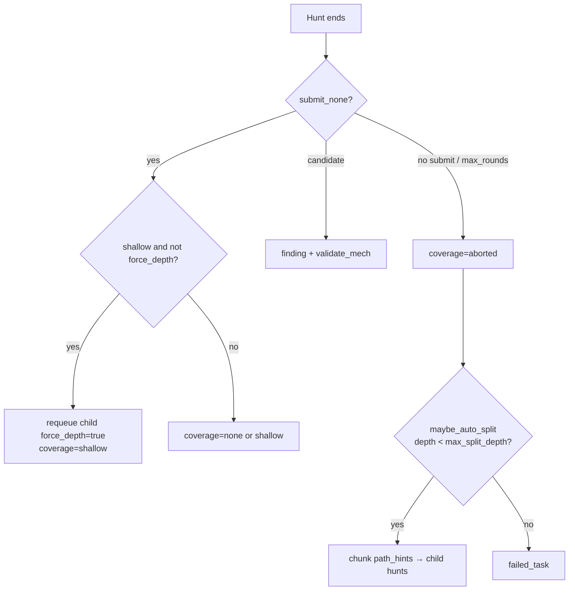
```mermaid
flowchart TD
  End["Hunt ends"]
  End --> Q1{submit_none?}
  Q1 -->|yes| Q2{shallow and not force_depth?}
  Q2 -->|yes| RQ["requeue child force_depth=true\ncoverage=shallow"]
  Q2 -->|no| None["coverage=none or shallow"]
  Q1 -->|candidate| Cand["finding + validate_mech"]
  Q1 -->|no submit / max_rounds| Abort["coverage=aborted"]
  Abort --> Split{"maybe_auto_split\ndepth < max_split_depth?"}
  Split -->|yes| Kids["chunk path_hints → child hunts"]
  Split -->|no| Fail["failed_task"]
```

Coverage **last_depth** values operators see: `planned` · `shallow` · `none` · `aborted` · `candidate` · `needs_human` · `confirmed`.

### Candidate body (mech-checked shape)

Rough required shape (see `validate_candidate_shape` / gates):

- `title`, `summary`, `weakness_class`
- `citations[]` with path + lines that resolve on target
- `threat_model` (attacker, boundary, impact — non-vacuous)
- `evidence_id` + pack **or** justified `no_poc` (≥20 chars)
- optional `severity_claim`, `sink_path` / `sink_symbol`, `poc_relpath`

**stable_key** = hash(profile, path, symbol, weakness, attacker, sink) — near-dup merge uses this.

---

## 10. LLM tool-loop (shared engine)

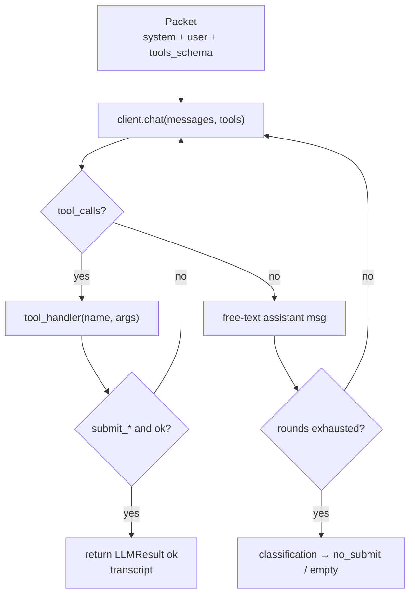
```mermaid
flowchart TD
  Packet["Packet\nsystem + user + tools_schema"]
  Chat["client.chat(messages, tools)"]
  TC{tool_calls?}
  Exec["tool_handler(name, args)"]
  Sub{"submit_* and ok?"}
  Free["free-text assistant msg"]
  Cap{"rounds exhausted?"}

  Packet --> Chat
  Chat --> TC
  TC -->|yes| Exec
  Exec --> Sub
  Sub -->|yes| Stop["return LLMResult ok\ntranscript"]
  Sub -->|no| Chat
  TC -->|no| Free
  Free --> Cap
  Cap -->|no| Chat
  Cap -->|yes| NS["classification → no_submit / empty"]
```

**Clients**

- Real: OpenAI-compatible (`chat_completions`), Responses API, Anthropic-style `messages` — config `llm.api_mode`.
- Default local: LM Studio + Ornith (`config/default.yaml`).
- Tests: **FakeLLM**.

**Temps (defaults)**

| Stage | Config key | Default |
|-------|------------|---------|
| recon | `temperature_recon` | 0.3 |
| hunt | `temperature_hunt` | 0.4 |
| disprove | `temperature_disprove` | 0.1 |
| max rounds | `max_tool_rounds` | 12 |

Packet budget: `refuse_if_over_budget` using char/token estimates (`packet.*` caps).

---

## 11. Tools surface (`code_static`)

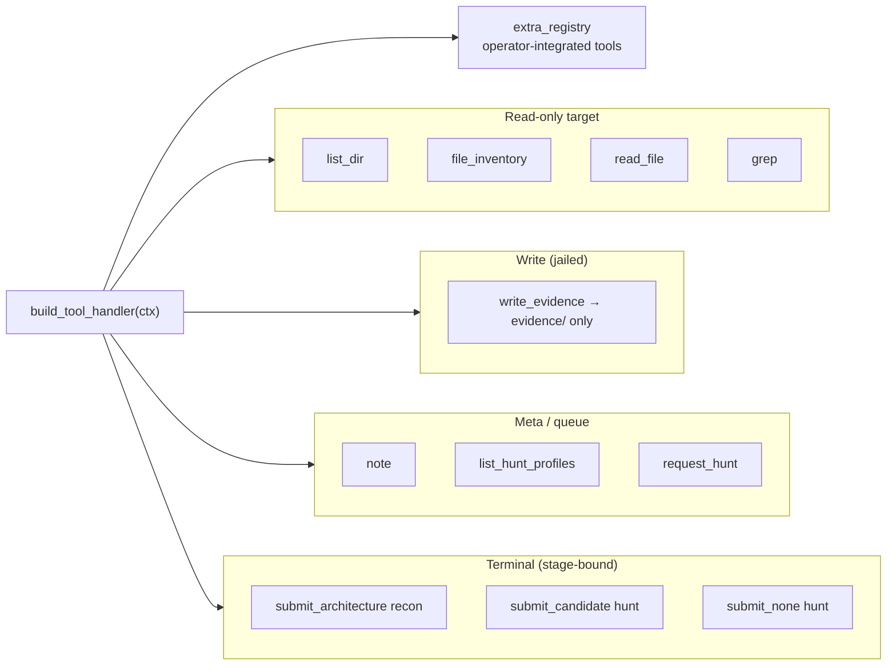
```mermaid
flowchart LR
  subgraph read["Read-only target"]
    LD[list_dir]
    FI[file_inventory]
    RF[read_file]
    GR[grep]
  end

  subgraph write["Write (jailed)"]
    WE[write_evidence → evidence/ only]
  end

  subgraph meta["Meta / queue"]
    NT[note]
    LHP[list_hunt_profiles]
    RH[request_hunt]
  end

  subgraph terminal["Terminal (stage-bound)"]
    SA[submit_architecture recon]
    SC[submit_candidate hunt]
    SN[submit_none hunt]
  end

  Handler["build_tool_handler(ctx)"]
  Handler --> read & write & meta & terminal
  Handler --> Extra["extra_registry\noperator-integrated tools"]
```

| Tool | recon | hunt | develop_poc |
|------|:-----:|:----:|:-----------:|
| `list_dir` | ✅ | ✅ | ✅ |
| `file_inventory` | ✅ | ✅ | ✅ |
| `read_file` | ✅ | ✅ | ✅ |
| `grep` | ✅ | ✅ | ✅ |
| `note` | ✅ | ✅ | ✅ |
| `submit_architecture` | ✅ | — | — |
| `submit_candidate` / `submit_none` | — | ✅ | — |
| `write_evidence` | — | ✅ | ✅ |
| `list_hunt_profiles` / `request_hunt` | — | ✅ | — |

- Paths relative to **target root** (or evidence pack for writes).
- **No unrestricted shell** on default `code_static` (`allow_exec = False`).
- `config/default_tools.json` may narrow stage tools; hunt always keeps submit tools.
- Hunt profiles may set optional **Approved tools** allowlist.

**Toolgen path** (Dev dashboard / offline): gap → draft → generate → `validate_tool` → integrate into `tools/`, `packet.py`, profile allowlist — see [`toolgen.md`](../toolgen.md).

---

## 12. Mechanical validation (`validate_mech`)

**No LLM.** Ordered checks:

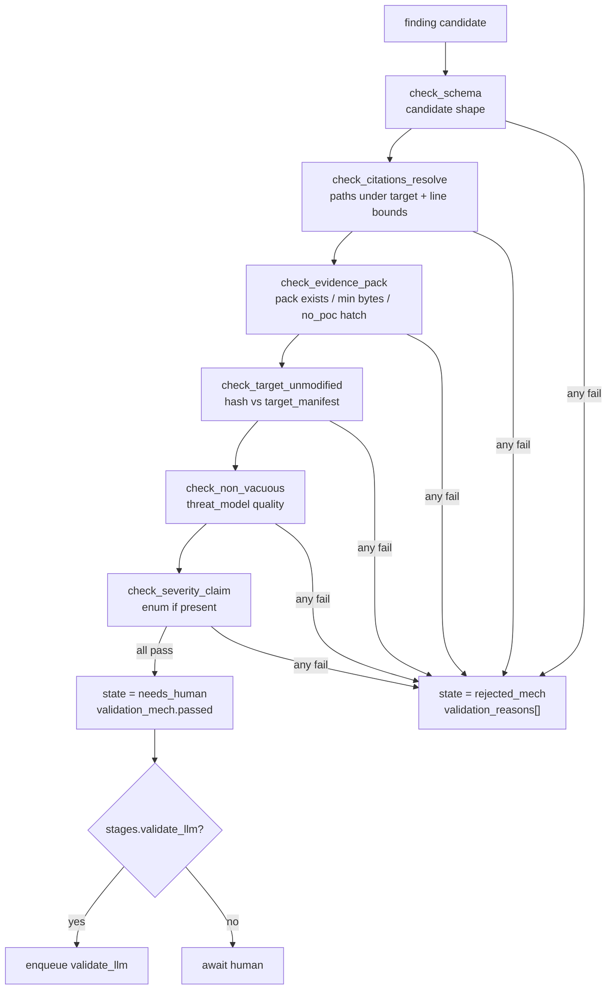
```mermaid
flowchart TD
  F["finding candidate"]
  C1["check_schema\ncandidate shape"]
  C2["check_citations_resolve\npaths under target + line bounds"]
  C3["check_evidence_pack\npack exists / min bytes / no_poc hatch"]
  C4["check_target_unmodified\nhash vs target_manifest"]
  C5["check_non_vacuous\nthreat_model quality"]
  C6["check_severity_claim\nenum if present"]
  Pass["state = needs_human\nvalidation_mech.passed"]
  Fail["state = rejected_mech\nvalidation_reasons[]"]
  Opt{"stages.validate_llm?"}

  F --> C1 --> C2 --> C3 --> C4 --> C5 --> C6
  C1 & C2 & C3 & C4 & C5 & C6 -->|any fail| Fail
  C6 -->|all pass| Pass
  Pass --> Opt
  Opt -->|yes| Enq["enqueue validate_llm"]
  Opt -->|no| Stop["await human"]
```

---

## 13. Optional LLM disprove (`validate_llm`)

Enabled only when `stages.validate_llm: true`.

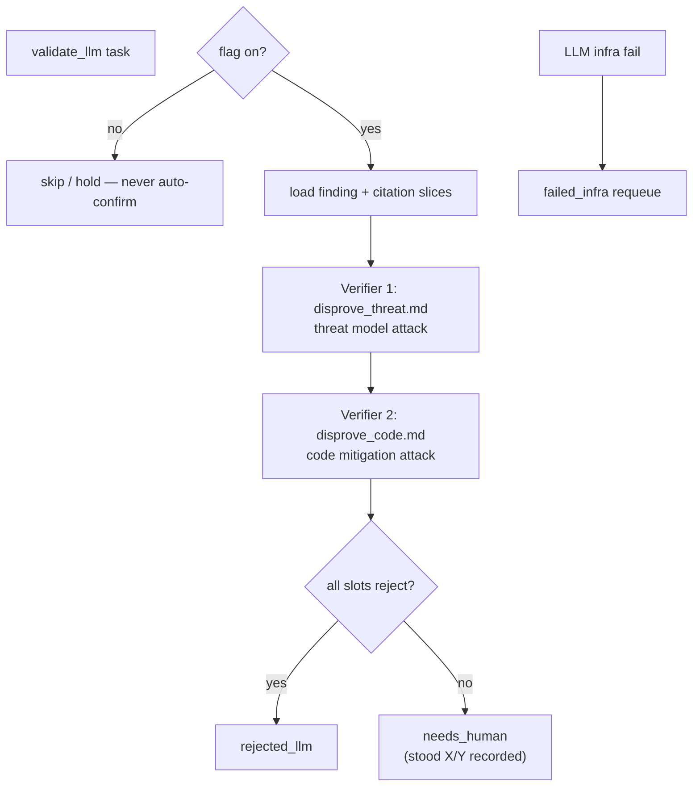
```mermaid
flowchart TD
  Start["validate_llm task"]
  Flag{"flag on?"}
  Flag -->|no| Skip["skip / hold — never auto-confirm"]
  Flag -->|yes| Load["load finding + citation slices"]
  Load --> V1["Verifier 1: disprove_threat.md\nthreat model attack"]
  V1 --> V2["Verifier 2: disprove_code.md\ncode mitigation attack"]
  V2 --> Agg{"all slots reject?"}
  Agg -->|yes| RL["rejected_llm"]
  Agg -->|no| NH["needs_human\n(stood X/Y recorded)"]
  Infra["LLM infra fail"] --> FI["failed_infra requeue"]
```

- Default dual slots from `llm.disprove_verifiers`.
- **Never** sets `confirmed`.
- Text-only packets (`pack_disprove`) — no submit_candidate.

---

## 14. Operator / secondary agents

### `develop_poc` (Report workshop)

- Trigger: human **Develop POC** → enqueue `develop_poc` with `finding_id`.
- Tools: read target + `write_evidence` only (no `submit_*`).
- Writes runnable scripts under `evidence/<pack>/` + hub `poc_develop.md`.
- Does **not** confirm findings.

### `generate_skill` / `generate_run_skills`

- Author or bulk-create hunt profile markdown into operator collection.
- Dynamic skills may auto-enqueue after recon when configured.

### `tool_gaps`

- Mine transcripts/events for tools the model wanted but lack.
- Writes `project/TOOL_GAPS.md` + `tool_gaps.json`.
- Modes: mechanical · llm · hybrid. Ideas ≠ mandates.

### Deferred: `gapfill`, `dedup`, `feedback`

- Modules under `stages/` exist for coverage fill / clustering / param proposals.
- Enqueue → `NotImplementedError` → **failed_task + progress** (does not halt Ralph).

---

## 15. Profiles

| Profile | Exec | Intent |
|---------|------|--------|
| **`code_static`** (default) | No | Source audit, read-only target |

| `code_exec` | (scaffold) | Future sandboxed exec |

`CodeStaticProfile.allowed_tools()` is the allowlist seed; packet schemas + stage filter enforce model surface.

---

## 16. Control plane ops (dashboard without raw SQL)

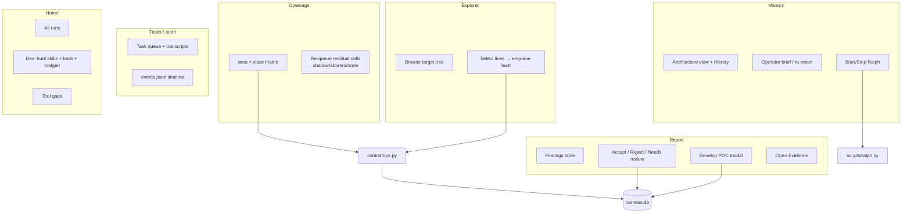
```mermaid
flowchart TB
  subgraph mission["Mission"]
    Arch["Architecture view + History"]
    Brief["Operator brief / re-recon"]
    RalphCtl["Start/Stop Ralph"]
  end

  subgraph coverage["Coverage"]
    Matrix["area × class matrix"]
    ReQ["Re-queue residual cells\nshallow/aborted/none"]
  end

  subgraph explorer["Explorer"]
    Browse["Browse target tree"]
    Sel["Select lines → enqueue hunt"]
  end

  subgraph report["Report"]
    Table["Findings table"]
    Rev["Accept / Reject / Needs review"]
    POC["Develop POC modal"]
    EvOpen["Open Evidence"]
  end

  subgraph tasks["Tasks / audit"]
    Queue["Task queue + transcripts"]
    Timeline["events.jsonl timeline"]
  end

  subgraph home["Home"]
    Runs["All runs"]
    Dev["Dev: hunt skills + tools + toolgen"]
    Gaps["Tool gaps"]
  end

  Matrix --> Ops["control/ops.py"]
  Sel --> Ops
  Ops --> DB[("harness.db")]
  Rev --> DB
  POC --> DB
  RalphCtl --> Ralph["scripts/ralph.py"]
```

| Mode | Purpose |
|------|---------|
| **Mission** | Campaign overview, architecture, Ralph control |
| **Coverage** | Residual-risk matrix; re-queue cells with notes |
| **Explorer** | Code browse; selection hunts (`POST …/hunts/from-selection`) |
| **Report** | Findings + human gates + PoC workshop |
| **Evidence** | On-disk packs |
| **Tasks** | Queue / transcripts / events |
| **Dev** | Hunt skills CRUD, recon agents, tool catalog/drafts |
| **Tool gaps** | Cross-run gap analysis |

---

## 17. Package map (code → responsibility)

```text
vulnforge/
  cli.py                 # vf entry: init, run-once, project, tool-gaps, dashboard
  db.py                  # SQLite + RunLock + lease/coverage/architecture API
  llm.py                 # HTTP clients + FakeLLM + run_tool_loop
  packet.py              # Packet builder + tool_schemas_for per stage
  control/ops.py         # Coverage requeue, cell detail, selection hunt, browse
  stages/
    recon.py             # Multi recon-agent map + hunt planner + merge
    hunt.py              # Area×class tool-loop + shallow/split + candidate prep
    validate_mech.py     # Pure gates CHECKS[]
    validate_llm.py      # Dual disprove aggregate
    develop_poc.py       # PoC workshop agent
    render.py            # project/* projection
    tool_gaps.py         # Stage wrapper for gap mining
    generate_skill.py    # Profile authoring
    generate_run_skills.py
    gapfill.py / dedup.py / feedback.py  # deferred
  tools/                 # Jail + inventory + grep + evidence + notes + request_hunt
  hunt_profiles/         # Operator collection store + generate
  recon_agents/          # Operator recon agent collection
  findings/              # stable_key + near-dup merge
  profiles/              # code_static (and scaffolds)
  toolgen/               # Draft → validate → integrate pipeline
  ui/                    # FastAPI research cockpit + static JS
  strategies.py          # discovery | file_by_file | recon_docs
  transcript.py / usage.py / util.py
```

---

## 18. End-to-end happy path (concrete)

```mermaid
sequenceDiagram
  actor Op as Operator
  participant Init as vf init
  participant Ralph as ralph.py
  participant VF as run-once
  participant Recon as recon agent(s)
  participant Hunt as hunt agent
  participant Mech as validate_mech
  participant UI as Dashboard Report

  Op->>Init: --target C:\app --strategy discovery
  Init->>Init: manifest + harness.db + enqueue recon
  Op->>Ralph: --run-dir runs/app/run-001
  Ralph->>VF: lease recon
  VF->>Recon: inventory + tool-loop + submit_architecture
  Recon->>VF: store architecture; enqueue hunts
  loop each hunt
    Ralph->>VF: lease hunt
    VF->>Hunt: tools + submit_candidate
    Hunt->>VF: finding candidate
    Ralph->>VF: lease validate_mech
    VF->>Mech: CHECKS
    Mech->>VF: needs_human
  end
  Ralph->>VF: idle → render project/*
  Op->>UI: Accept finding → confirmed
```

---

## 19. Config knobs that steer agents

| Area | Keys | Effect |
|------|------|--------|
| LLM endpoint | `llm.base_url`, `model`, `api_mode`, `timeout_seconds` | Where/how models run |
| Tool budget | `llm.max_tool_rounds`, temps | Depth vs thrash |
| Concurrency | `run.max_leases_parallel` | Parallel Ralph workers |
| Retries | `run.max_task_attempts`, `max_recon_auto_retries` | Infra vs recon recovery |
| Split | `run.max_split_depth` | Auto-split aborted hunts |
| Stages | `stages.validate_llm`, gapfill, dedup, feedback | Optional pipeline arms |
| Packet slim | `packet.max_architecture_chars`, `max_seed_sinks`, … | Context budget |
| Tools caps | `tools.max_read_bytes`, grep/inventory caps | Jail resource limits |
| Skill policy | `run.hunt_skill_mode`, `hunt_skill_ids` | Restrict classes for a run |
| Auto gaps | `run.auto_tool_gaps`, `tool_gaps_mode` | Idle mining |

---

## 20. Mental model: “who is an agent?”

| Actor | Stateful? | LLM? | Finishes via |
|-------|-----------|------|--------------|
| **Ralph** | process loop only | No | exit codes / STOP |
| **run-once worker** | one lease | No | stage result |
| **Recon agent profile** | one tool-loop pass | Yes | `submit_architecture` |
| **Hunt skill profile** | one tool-loop | Yes | `submit_candidate` / `submit_none` |
| **validate_mech** | pure function | No | finding state transition |
| **Disprove verifiers** | sequential chats | Yes | reject vs stand aggregate |
| **develop_poc** | one tool-loop | Yes | evidence files written |
| **Human operator** | UI | No | confirm / reject / steer queue |

VulnForge deliberately **does not** keep a long-lived conversational agent across the campaign. Continuity is:

1. **Queue** (what to do next),  
2. **Architecture + coverage** (what we think we know),  
3. **Findings + evidence** (what we claim),  
4. **Transcripts** (how the model behaved last time).

That is the full agent topology at operator and implementer granularity.

---

## Related docs

- [`PROTOCOL.md`](../PROTOCOL.md) — wire contract, exit codes, tools table  
- [`AGENTS.md`](../AGENTS.md) — using/extending (skills, toolgen, honesty)  
- [`toolgen.md`](../toolgen.md) — adding agent tools end-to-end  
- `docs/superpowers/specs/2026-07-18-dual-llm-disprove-design.md` — validate_llm design
)